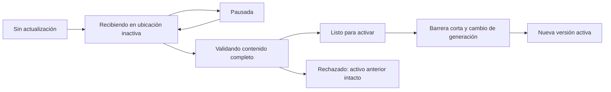

# Emparejamiento con app y actualización de mapas

Estado: propuesta de arquitectura; no hay app ni instalador integrados.
La integración completa con UI, energía y OTA está en el
[blueprint definitivo](blueprint-firmware.md); ejecución en P07/P08 del
[plan](plan-evolucion.md).
Conserva los datos geográficos actuales y propone entregarlos en una
[cápsula indexada](capsula-mapas.md), consultable sin un filesystem de tiles.
El borrador v2/zonas se evalúa después y no bloquea ninguna integración.

## Experiencia propuesta

1. La primera vez, la app descubre la unidad por BLE y verifica identidad y prueba
   de posesión por unidad, por ejemplo un QR entregado con el equipo. Guarda el
   vínculo autorizado y un nombre reconocible; no selecciona por señal más fuerte.
2. El usuario elige su cobertura y toca «Actualizar mapas». La app recuerda esa
   selección y consulta firmware, formatos soportados, regiones instaladas y espacio.
3. Descarga el paquete al teléfono cuando dispone de Internet. Luego puede
   transferirlo localmente al HUD sin que Starlink esté disponible.
4. Desde la app vinculada, el usuario solicita mantenimiento por BLE; el HUD
   autentica y aplica su política de energía/vehículo. No hace falta configurar
   una red ni repetir el QR. Incorporar otro dueño requiere autorización específica.
5. La app transfiere por bloques y muestra progreso de recepción, validación y
   activación por separado. Si se desconecta, puede reanudar.
6. El HUD verifica el paquete y lo activa en una condición establecida por la
   política de mantenimiento. La app recibe la versión efectivamente activa.

No depender de touch para entrar en mantenimiento: está deshabilitado en el
firmware actual. Definir el mecanismo físico o de posesión inicial, revocación de
teléfonos y recuperación por servicio antes de implementar el emparejamiento.

## Transporte

Decisión de diseño: **app y BLE como acceso habitual, incluyendo transferencia
completa; Wi-Fi como aceleración opcional**. El cliente no debe configurar Wi-Fi
en el display para poder actualizar. Es una propuesta pendiente de validar; en el
`sdkconfig` revisado, `CONFIG_BT_ENABLED` está deshabilitado. La capacidad del chip
no implica que el servicio BLE esté implementado.

La app conserva la cápsula local y estima la duración con bytes restantes y caudal
útil observado, incluyendo pausas de escritura. Si esa duración es aceptable,
continúa por BLE sin cambiar la red del teléfono. Si es larga, ofrece «Transferir
más rápido» con conexión local guiada, o permite seguir por BLE/pausar. No se fija
un umbral universal de MB ni se usa la velocidad PHY como velocidad del instalador.

Ejemplo de dimensionamiento, **no benchmark**: a un caudal supuesto de 30 kB/s,
5 MB decimales tardan unos 2 min 47 s y 50 MB unos 27 min 47 s, más validación y
activación. Medir tamaños reales de cobertura y caudal en teléfonos objetivo
antes de prometer tiempos. La viabilidad comercial de mapas grandes por BLE
queda pendiente; disponer de Wi-Fi rápido no reemplaza esa medición.

ESP-IDF ofrece mecanismos de provisioning sobre BLE o SoftAP. Evaluar
`protocomm` Security 2 para la sesión inicial: está disponible en el SDK local
5.4.4 y usa SRP6a/AES-GCM. No asumir que esa sesión protege automáticamente un
servidor de archivos separado; hay que vincular y autenticar también la sesión
de transferencia. Fuente: [Protocomm](https://docs.espressif.com/projects/esp-idf/en/v5.1/esp32s3/api-reference/provisioning/protocomm.html).

| Camino | Utilidad | Condición |
| --- | --- | --- |
| App → BLE → HUD | Vincular, consultar, configurar y transferir cápsula completa sin cambiar de red | App autorizada, transferencia fragmentada con flujo acotado; medir duración |
| Teléfono conectado al SoftAP del HUD | Transferencia directa, sin infraestructura | Paquete descargado previamente; probar cambio de red y permisos Android/iOS |
| Ambos en la misma Wi-Fi | Transferencia local y acceso a Internet | Descubrimiento y alcance entre clientes dependen del AP |
| HUD descarga por Wi-Fi | Actualización futura desde depósito/Starlink | Mismo instalador; cliente de descarga distinto |

La app no necesita acceso al socket Ruptela ni conocer sus credenciales. La
autenticación del teléfono controla quién puede iniciar acciones. Una firma de
paquete controla qué contenido se permite instalar: son controles distintos.

### Un instalador y dos transportes

BLE expone servicio GATT con control, entrada de datos y estado/progreso. Usar
escrituras/notificaciones y primitivas del SDK con autenticación y cifrado
validados; descubrir el servicio no da permiso para instalar. Negociar tamaño
útil, fragmentar mensajes y usar créditos/ventana limitada: una escritura aceptada
por Bluetooth no significa que el bloque esté persistido en SD. El callback BLE
solo encola trabajo acotado; el worker escribe, valida y confirma progreso.

La unidad identifica la actualización por paquete, dueño autorizado y sesión,
independientemente del enlace. Capacidades declara transportes soportados y si
permite continuar una sesión por otro. En el primer corte de app, BLE debe poder
cerrar el flujo completo con una cápsula representativa; un cliente de banco
SoftAP puede avanzar antes sin esperar BLE, app ni v2.

Para pasar al modo rápido:

1. Pausar el envío y obtener el checkpoint durable. El gestor de conectividad
   autoriza el uso de SoftAP según el estado de telemetría/mantenimiento.
2. Entregar por el canal BLE autenticado la identidad de red temporal, credencial
   efímera y datos para autenticar el canal Wi-Fi. La app solicita la conexión
   mediante APIs del sistema; el usuario puede tener que aceptarla. No pedir que
   escriba contraseñas ni prometer un cambio silencioso.
3. Reautenticar y continuar desde el offset durable de la misma candidata. Solo
   un transporte puede escribir; renovar el permiso de escritura invalida al
   anterior. Rechazar mensajes tardíos de la sesión de transporte anterior.
4. Si falla o el usuario rechaza Wi-Fi, apagar la red temporal cuando corresponda,
   reconectar BLE y consultar el progreso para continuar. El paquete queda en el
   teléfono y el mapa activo no se modifica por el cambio de enlace.

No depender de BLE conectado mientras SoftAP transfiere: control/progreso también
viajan por el canal Wi-Fi autenticado. Probar el tramo de transición y permitir
suspender BLE conservando la capacidad de reiniciarlo. ESP32-S3 comparte radio y
la tabla del SDK 5.4.4 clasifica SoftAP conectado + BLE como coexistencia con
rendimiento inestable. Fuente: [coexistencia ESP-IDF](https://docs.espressif.com/projects/esp-idf/en/v5.4.4/esp32s3/api-guides/coexist.html).
La conexión asistida puede requerir consentimiento del sistema:
[Android Network Request API](https://developer.android.com/develop/connectivity/wifi/wifi-bootstrap)
y [Apple NEHotspotConfigurationManager](https://developer.apple.com/documentation/networkextension/nehotspotconfigurationmanager/apply(_:completionhandler:)).

Primer producto: actualización con app abierta y equipo en mantenimiento. Si el
sistema suspende o termina la app, conservar progreso y reanudar al volver; no
prometer transferencia automática ilimitada en segundo plano. Apple documenta
condiciones específicas para ejecución/restauración BLE en
[Core Bluetooth](https://developer.apple.com/library/archive/documentation/NetworkingInternetWeb/Conceptual/CoreBluetooth_concepts/CoreBluetoothBackgroundProcessingForIOSApps/PerformingTasksWhileYourAppIsInTheBackground.html).

## Formato, paquete y versión

El primer instalador conserva los payloads v1 y agrega una fuente de cápsula al
lector: índice de coordenadas a offset/longitud y payloads dentro de un contenedor.
El HUD consulta ese contenedor directamente, sin extraer archivos por tile. La
fuente de directorio permanece para compatibilidad y pruebas de equivalencia.
No requiere otro formato geográfico. Mapas v2/zonas queda como investigación posterior.

El manifiesto de instalación propuesto contiene región, versión de contenido,
versión de formato, compatibilidad de lector, tamaño total y hashes ligados al
paquete. Para distribución de producción, definir firma, clave confiable y
procedimiento de rotación. El contrato exacto de serialización/firma queda por
especificar; los payloads conservan el formato de tiles que ya lee el firmware.
La versión del contenedor se negocia separadamente. Ver el
[diseño de cápsula](capsula-mapas.md) para índice, memoria y etapas de integración.

El generador no debe modificar headers C al producir mapas. Los parámetros
geométricos se declaran en el manifiesto y el lector verifica que coinciden con
los que soporta; declararlos no vuelve dinámico al lector actual. La
versión de contenido es independiente de la versión de firmware.

## API lógica entre app e instalador

Estos son nombres de operaciones propuestos, no endpoints implementados.

| Operación | Contrato |
| --- | --- |
| `get_capabilities` | Identidad HUD, firmware, formatos, transportes/reanudación entre enlaces, límites y capacidades de mantenimiento |
| `get_map_status` | Región/versión activa, fallback, espacio disponible y operación pendiente |
| `begin_update` | Manifiesto validado; devuelve ID opaco de sesión y límites de recepción |
| `write_chunk` | ID, offset, longitud, bytes y verificación; duplicados idénticos idempotentes |
| `get_update_status` | Estado, bytes confirmados recuperables y error tipado |
| `finish_upload` | Solicita validación completa; no activa por implicación |
| `activate_update` | Solicita activación del paquete verificado bajo política del equipo |
| `cancel_update` | Cancela solo la sesión parcial; nunca borra el dataset activo |

El equipo genera rutas internas; el cliente no elige rutas arbitrarias de SD.
Una sola actualización simultánea en el primer corte. Declarar máximos de tamaño,
offsets y metadatos; rechazar overflow, rangos inválidos y parámetros incompatibles.

Recepción y durabilidad son estados diferentes. Confirmar progreso persistente
solo tras el punto de escritura/sincronización acordado. Después de reiniciar,
revalidar el prefijo confirmado antes de ofrecer reanudación; una sesión RAM no
demuestra que la SD conservó esos bytes.

## Instalación y recuperación

Mantener como mínimo dos generaciones por región: activa y candidata/anterior.
Si un rollback de firmware requiere conservar otro mapa compatible, reservar una
generación adicional o rechazar la nueva actualización por espacio insuficiente;
no borrar ese último fallback para recibir otra candidata. Reservar espacio antes
de aceptar la transferencia. No sobrescribir el contenedor en uso. Para el primer corte
actualizar una región por operación; una transacción de varias regiones requiere
un contrato adicional.

Secuencia propuesta de activación:

1. Completar y sincronizar el archivo candidato; verificar integridad, estructura,
   región, compatibilidad y versión. Reabrirlo mediante el lector real.
2. Marcarlo listo; esperar condición de mantenimiento. No interpretar GPS
   inválido como vehículo detenido. Umbrales de velocidad y permanencia pendientes.
3. Detener nuevas consultas, esperar lectores activos y preparar la nueva fuente.
4. Guardar un registro pequeño de selección con esquema, secuencia, región,
   identidad/hash de candidata y anterior. Usar dos registros recuperables en NVS;
   no asumir una transacción atómica entre múltiples claves ni entre NVS y SD.
5. Cambiar la fuente en RAM, incrementar generación, invalidar caché y resetear
   histéresis. Reanudar consultas y publicar versión activa a UI/app.
6. Conservar la generación anterior hasta superar la aceptación definida. La
   limpieza se limita a generaciones verificadas como inactivas y no referenciadas.

En cada arranque, validar los registros de selección y el archivo al que apuntan.
Si la candidata está incompleta o dañada, elegir la anterior verificable. Si no
hay ninguna válida, informar mapas no disponibles y conservar velocidad/ignición.
La selección debe incluir identidad del paquete para detectar cambio de tarjeta.

La validación de mapas no retrasa el arranque de UART/UI. Definir verificación
completa al instalar y validación de tiles al leer contra el inventario
autenticado del paquete. Un hash comprobado antes de apagar
no demuestra que una SD removible siga intacta al volver a encender. CRC detecta
errores accidentales; no sustituye la autenticación del contenido.

NVS está diseñado para recuperación ante cortes, pero eso no convierte una
escritura NVS+SD en una transacción. FAT puede corromperse ante pérdida de energía;
dos generaciones en la misma SD tampoco garantizan supervivencia de toda la
tarjeta. Probar cortes en cada etapa y mantener recuperación desde la app/servicio.
Fuentes: [NVS](https://docs.espressif.com/projects/esp-idf/en/v5.4.4/esp32s3/api-reference/storage/nvs_flash.html)
y [sistemas de archivos ESP-IDF](https://docs.espressif.com/projects/esp-idf/en/v5.4/esp32s3/api-guides/file-system-considerations.html).

## Convivencia y alcance

Durante descarga se sigue leyendo la generación activa, con I/O y memoria
acotados. Si se degrada UART/pantalla o se requiere telemetría prioritaria, pausar
la descarga. La activación es breve y coordinada por `map_store`; la app no cambia
punteros de caché ni variables del matcher.

Mapas y firmware tienen instaladores y compatibilidades distintos. Los slots
OTA ya reservados no implementan actualización de mapas. La actualización
del firmware tiene validación de arranque, rollback y compatibilidad propios,
especificados en la sección 13 del [blueprint](blueprint-firmware.md). Queda fuera
del primer instalador de mapas, pero comparte su política de mantenimiento.
