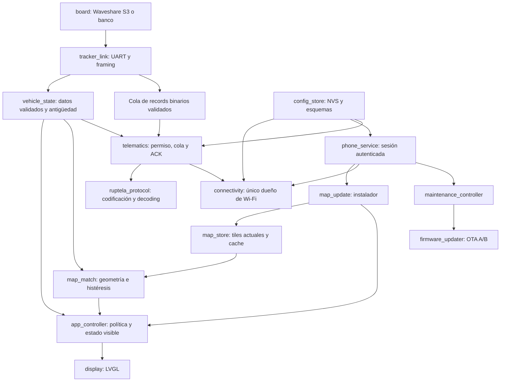

# Arquitectura propuesta para crecer

Estado: diseño propuesto. Base y limitaciones: [estado actual](estado-actual.md).
Esta es la vista resumida. El [blueprint definitivo](blueprint-firmware.md)
amplía hardware, UI, contratos, OTA y recuperación; el
[análisis de memoria](hardware-y-memoria.md) fija los cálculos y experimentos.
Los nombres de componentes/interfaces siguientes definen responsabilidades; no
representan archivos o APIs ya disponibles.

## Objetivos y reglas

1. La función de velocidad y mapas funciona sin Internet, teléfono ni Starlink.
2. La SD ausente afecta mapas y almacenamiento persistente, pero no impide recibir
   el Ruptela ni gestionar ignición y velocidad.
3. Cada recurso tiene un único responsable: UART, estado de vehículo, radio,
   socket de telemetría, catálogo de mapas y widgets LVGL.
4. Ningún callback UART/evento hace DNS, conexión, espera de ACK, hashing grande
   o escritura prolongada en SD. Publica datos acotados y retorna.
5. Los algoritmos de framing, protocolo, matching y políticas son testeables en
   host; ESP-IDF, FreeRTOS y LVGL quedan en los adaptadores correspondientes.
6. Agregar una función no significa agregar una tarea: se crean tareas por
   aislamiento de latencia y propiedad de recursos.

## Módulos y dependencias

`board` concentra pines, panel, touch, SD y capacidades. El target de banco omite
display/mapas; reutiliza los mismos componentes de recepción, protocolo y red.
No mantener copias distintas de los parsers entre HUD y piloto.

En este diseño, «módulo Wi-Fi» significa un componente de software que administra
la radio del ESP32-S3 de la Waveshare. No se presupone una segunda placa de red.
El piloto WROOM es un target de pruebas, no otro procesador necesario en el producto.

`map_match` no conoce rutas de archivos, sockets, LVGL ni FreeRTOS. Recibe una
fuente de candidatos y su estado explícito. `map_store` resuelve formato,
generación activa, lectura e invalidación. Se extrae la implementación actual;
no se adopta el borrador v2/zonas, que queda como investigación opcional.

## Contratos de datos

| Contrato propuesto | Información mínima |
| --- | --- |
| Fix GPS | Secuencia de recepción, tiempo monotónico, UTC del tracker si válido, posición y velocidad con unidades explícitas, rumbo y validez por campo |
| Señal IO | ID, valor tipado, presente/válido, instante de última actualización del propio IO |
| Record Ruptela | IMEI asociado, sesión del tracker, secuencia local, instante de recepción, bytes y longitud del record validado |
| Resultado de mapa | Secuencia del fix, versión de dataset, estado, límite y procedencia, nombre y procedencia, distancia y flags de ambigüedad |
| Estado de pantalla | Velocidad, límite, antigüedad, estados de GPS/mapas/red, ignición y progreso de mantenimiento |

La validez no se codifica como velocidad cero o coordenadas cero. Cero km/h es un
valor legítimo. Un límite desconocido es distinto de un límite obtenido de una vía
sin nombre, de uno inferido por el generador y de uno conservado de un fix anterior.

Cada consumidor evalúa frescura con tiempo monotónico. UTC sirve para registros
y servidor, pero no para temporizadores: puede faltar o saltar. La llegada de un
record sin IO 418 no renueva la frescura de ese IO. Un salto de posición o una
reconexión prolongada puede requerir reset de histéresis.

Un resultado tardío del matcher solo se aplica si corresponde al fix y generación
admitidos por la política. Un resultado de un mapa desactivado se descarta.

## Tareas, colas y propiedad

| Responsable | Trabajo | Comunicación y saturación |
| --- | --- | --- |
| Recepción UART | Drenar bytes, framing, validación y publicación | Buffers acotados; contar overflow y resincronizar ambos parsers ante pérdida |
| Control de aplicación | Validez/frescura, ignición, estado visible | Snapshot coherente; señal de revocación de telemetría que no dependa de una cola de records llena |
| Worker de matching | Buscar candidatos y resolver límite | Mailbox de último fix; evitar acumular posiciones obsoletas |
| Tarea LVGL | Aplicar snapshot, ticks, animaciones y panel | Único escritor de widgets; incluir splash y apagado/encendido |
| Worker de telemetría | Conectar, enviar, recibir ACK, reintentar | Cola acotada con retención, descarte y contadores documentados |
| Worker de instalación | Transferir, validar y preparar activación | Una sesión de actualización; bloques pequeños, cancelación y progreso |

`connectivity` coordina eventos y solicitudes de red; puede compartir un worker
de control si no introduce esperas largas. Las prioridades y afinidades se fijan
con mediciones en la S3. No copiar automáticamente las prioridades del piloto.

La velocidad visible se actualiza al recibir un fix utilizable, independientemente
de que termine la consulta SD. El resultado de matching actualiza luego el límite
con su referencia al fix. Esto evita que una SD lenta congele el velocímetro.

Los eventos transportan copias o buffers de un pool con transferencia explícita de
propiedad. No encolar punteros al buffer UART reutilizable, al payload temporal de
un evento ni a un tile que pueda ser desalojado. No confiar en `volatile` como
sustituto de colas, mutex o atómicos.

La finalización asíncrona del flush es una excepción del puerto: puede notificar
`lv_disp_flush_ready` según contrato del driver/LVGL, sin manipular widgets desde
ISR. El modelo de único escritor incluye splash, navegación y transiciones de panel.

## Almacenamiento y memoria

- Mantener buffers de display y otras asignaciones con capacidades específicas
  bajo control. Registrar heap interno libre mínimo y bloque libre máximo,
  además de PSRAM; el total libre por sí solo no garantiza una asignación.
- La caché actual tiene presupuesto de 2 MiB y 512 entradas. Wi-Fi, TLS y la app
  agregan consumos que todavía no se midieron junto al display. El presupuesto
  de caché debe poder ajustarse; la expulsión debe liberar espacio antes de una
  asignación que lo necesite.
- Transferir paquetes de mapas por bloques; no cargarlos completos en RAM.
  Tamaño de transferencia y tamaño de tile son parámetros distintos; empaquetar
  tiles actuales no requiere cambiar su representación geográfica. La
  [cápsula propuesta](capsula-mapas.md) se consulta por índice y rangos sin extraer
  archivos por tile; su backend se añade después de encapsular la fuente actual.
  Evaluar v2/zonas después no bloquea ninguna integración.
- Coordinar SD con bloqueos cortos y prioridades. No mantener el bloqueo del
  catálogo durante una descarga, un hash completo o toda una consulta de mapa.
- La activación obtiene una barrera corta: detiene nuevas consultas, espera
  lectores activos, cambia generación, invalida caché y reinicia matching.
- NVS almacena configuración pequeña y selección de versión; SD almacena mapas
  y, si se implementa, un journal acotado de telemetría. NVS no es una cola de
  registros frecuentes. Fuente: [NVS de ESP-IDF](https://docs.espressif.com/projects/esp-idf/en/v5.4.4/esp32s3/api-reference/storage/nvs_flash.html).

## Configuración e identidades

Separar tres identidades: dispositivo HUD para emparejamiento/inventario, IMEI real
del Ruptela para telemetría, y versión del dataset para matching. Una MAC visible
identifica una unidad, pero no autentica a una app.

`config_store` valida esquemas, tamaños, rangos y migraciones. Importar
`telematics.json` puede servir como transición desde laboratorio, con política
clara de precedencia frente a NVS. La app configura credenciales sin recompilar;
no se exponen contraseñas en logs ni endpoints de diagnóstico.

No trasladar al producto el borrado global de NVS que el piloto ejecuta ante
ciertos errores: en la arquitectura nueva podría borrar emparejamiento, redes y
selección de mapas. Diseñar recuperación por namespace y modo de servicio.

## Estados de falla visibles

| Condición | Comportamiento propuesto |
| --- | --- |
| GPS inválido o vencido | Velocidad no presentada como actual; suspender matching y marcar estado |
| GPS válido, mapa ausente | Mostrar velocidad; límite desconocido o último conocido identificado como tal |
| Ignición desconocida | Mantener política actual de panel inicialmente apagado hasta una decisión de producto distinta |
| Red o servidor caído | Operación local normal; política de cola/backoff, sin reinicio global |
| App desconectada | Instalación parcial recuperable; dataset activo intacto |
| IO 418 desconocido/vencido | Deshabilitar envío de backup y cerrar su socket |

La retención de ignición y la retención de permiso de telemetría son políticas
distintas. El comportamiento histórico del display no autoriza retener un permiso
de envío después de perder comunicación con el tracker.

## Regla de incorporación de nuevas funciones

Toda propuesta debe identificar consumidor de datos, propietario de estado,
memoria/colas máximas, errores recuperables, impacto en el camino GPS-pantalla,
migración de configuración y evidencia de pruebas. Mantener el código generado
de UI separado de la política de negocio; preferir adaptadores externos y cambios
en la fuente del generador cuando se modifique diseño visual.
