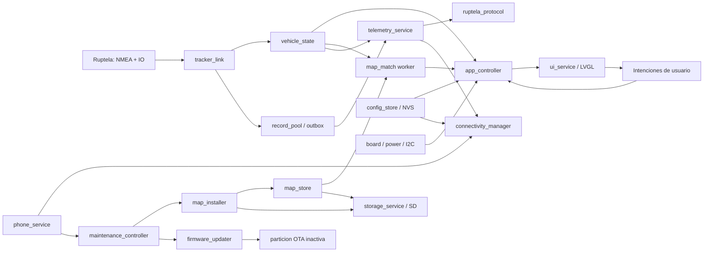
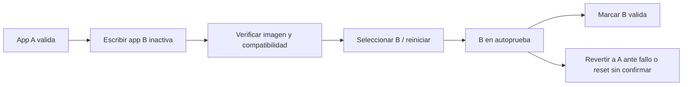

# Blueprint del firmware definitivo — Waveshare ESP32-S3 / Ruptela

Revisión: 2026-09-05 · Investigación de fuentes: 2026-09-04.
Estado: propuesta de arquitectura, pendiente de implementación.

Decisión de alcance: ordenar el firmware conservando los tiles actuales. Mapas
v2/zonas es una idea por evaluar, no un requisito aprobado. No condiciona app,
instalador de mapas ni OTA. Ver [backlog operativo](tareas-firmware.md).

## Índice

- [1. Resultado y alcance](#1-resultado-buscado-y-alcance)
- [2. Diagnóstico](#2-diagnóstico-que-justifica-el-refactor)
- [3. Decisiones](#3-decisiones-de-arquitectura)
- [4. Componentes y ownership](#4-componentes-dependencias-y-ownership)
- [5. Datos, validez y tiempo](#5-modelo-de-datos-validez-y-tiempo)
- [6. Concurrencia y arranque](#6-concurrencia-latencia-y-arranque)
- [7. UI](#7-arquitectura-de-ui)
- [8. Ruptela](#8-enlace-con-ruptela)
- [9. Mapas y matching](#9-mapas-y-motor-de-matching)
- [10. Wi-Fi/Starlink](#10-wi-fi-starlink-y-entrega-de-telemetría)
- [11. Teléfono](#11-integración-con-teléfono)
- [12. Instalación de mapas](#12-instalación-de-mapas-y-recuperación)
- [13. OTA](#13-ota-de-firmware)
- [14. Mantenimiento y energía](#14-mantenimiento-energía-y-prioridades-de-producto)
- [15. Pruebas y release](#15-observabilidad-pruebas-y-release)
- [16. Decisiones pendientes](#16-decisiones-pendientes-para-cerrar-producción)

## 1. Resultado buscado y alcance

Construir un firmware de producto que mantenga su función principal —mostrar
velocidad del vehículo y límite obtenido del mapa local— y permita incorporar
telemetría de respaldo por Wi-Fi/Starlink, una app de teléfono, actualización de
mapas y OTA sin volver a entremezclar recepción, pantalla, almacenamiento y red.

**Recomendación: refactor incremental de arquitectura, conservando el HUD
funcional como referencia.** No reescribir todo junto, no copiar el piloto de
Starlink dentro de `app_main` y no cambiar simultáneamente SDK, UI y matching.

Este documento especifica el destino. El [plan de implementación](plan-evolucion.md)
divide el trabajo en entregas comprobables. El análisis cuantitativo de RAM,
GRAM, buses y periféricos está en [hardware y memoria](hardware-y-memoria.md).

El término «definitivo» significa una base mantenible y contratos estables, no
que todas las funcionalidades futuras deban implementarse en la primera versión.
La propuesta no configura la placa, modifica el Ruptela, quema eFuses ni habilita
conexiones de producción.

### Cómo leer las afirmaciones

- **Observado:** sale del código/configuración/build disponible en este árbol.
- **Documentado:** especificación publicada por fabricante/SDK, citada con enlace.
- **Propuesto:** decisión de ingeniería de este blueprint, todavía sin integrar.
- **Por medir/confirmar:** exige unidad física, captura o decisión de producto.

El árbol tiene cambios locales: no se presupone que coincida con el firmware
instalado. Tampoco un límite en un dataset demuestra por sí solo la norma vigente
en la calle: conservar procedencia, antigüedad y estados desconocido/inferido.
La UI no debe presentar un valor inválido o retenido como límite actual confirmado.

## 2. Diagnóstico que justifica el refactor

El detalle completo está en [estado actual](estado-actual.md). Los problemas que
condicionan la expansión son estos:

| Situación observada | Riesgo al agregar funciones | Frontera que falta |
| --- | --- | --- |
| `app_main` recibe posición, lee mapa y luego publica velocidad | Una SD lenta retrasa el velocímetro | Separar actualización de vehículo y worker de matching |
| Parser ejecuta callbacks con acciones de display/SD | Esperas de UI o persistencia retrasan UART | Recepción solo valida y publica |
| UI repartida entre `dynamic`, `vars`, splash, puerto y EEZ | Carreras y pantallas nuevas acopladas al negocio | Modelo de presentación y único escritor LVGL |
| Datos GPS/IO sin contrato uniforme de validez/frescura | Velocidad/límite/permiso de envío pueden quedar obsoletos | Estado explícito con tiempo monotónico por señal |
| Fallo de SD aborta antes de arrancar parser | Se pierde incluso función que no necesita mapas | Arranque degradado independiente |
| Matching y caché mantienen estado estático sin generación/reset | Actualizar archivos no actualiza coherentemente el resultado | `map_store` versionado y `map_match_state` explícito |
| Piloto mezcla Wi-Fi, política, protocolo, cola y socket | App y telemetría competirían por una sola radio | Gestor de conectividad y cliente separados |
| Los ACK no gobiernan la eliminación de pendientes | Pérdida silenciosa o duplicados no controlados | Máquina de entrega con lote en vuelo |
| Dos buffers LVGL consumen 211,16 KiB internos | Poco margen para stacks, radio y TLS | Presupuesto por capacidades y flush acotado |
| Particiones OTA existentes, sin instalador/rollback configurado | Dos slots no equivalen a OTA recuperable | Servicio OTA y validación de arranque |

Además hay una discrepancia que merece una prueba aislada: Waveshare documenta
CO5300, mientras el driver local se llama SH8601. La pantalla funciona según el
usuario; no se deduce de la diferencia de nombres que haya que reemplazarla ya.

## 3. Decisiones de arquitectura

| ID | Decisión propuesta | Motivo / condición de revisión |
| --- | --- | --- |
| D01 | Producto local-first: velocidad y mapas no necesitan Internet | Red/app son funciones adicionales |
| D02 | Un dueño por recurso y por estado mutable | Hace comprobable quién puede cambiarlo |
| D03 | Parser, protocolo, políticas y matemática extraíbles a C testeable en host | Mismos componentes en HUD y banco |
| D04 | Último fix para HUD/matching; cola distinta para records | Frescura de pantalla y entrega son problemas diferentes |
| D05 | UI solo representa snapshots y emite intenciones | Sin SD, socket o política de negocio dentro de widgets |
| D06 | Una sola administración de Wi-Fi; permiso de telemetría separado | Volver a celular no debe cortar una app conectada |
| D07 | Mapas como generaciones verificadas, nunca parcheo de archivos activos | Recuperación y caché coherente |
| D08 | Transporte de descarga separado de instalador | Teléfono, depósito y Starlink usan el mismo contrato |
| D09 | OTA A/B de aplicación con autoprueba y rollback | Arranque recuperable sin depender del teléfono |
| D10 | Memoria y operaciones acotadas; no cargar mapas/firmware completos | Protege UART/UI y permite medir máximos |
| D11 | Cambios de algoritmo separados de movimientos de código | Comparación antes/después sobre el mismo replay |
| D12 | Servicios opcionales habilitados por capacidades y política | No crear una tarea permanente por cada periférico |
| D13 | Firmas de contenido, autenticación de app y TLS son controles distintos | Un hash aislado no prueba quién publicó el paquete |
| D14 | Una actualización mutante a la vez: mapa o firmware | Simplifica memoria, energía y recuperación inicial |

## 4. Componentes, dependencias y ownership



Las flechas representan flujo lógico, no autorización para llamar funciones
bloqueantes desde un callback. Transporte, control y workers se comunican con
contratos acotados. No hace falta un event bus genérico con asignaciones dinámicas.

### Estructura objetivo

Árbol propuesto, todavía no creado:

```text
Firmware/
  main/
    app_main.c                 # composición, arranque y supervisión
  components/
    board_waveshare_175/        # pines, panel, touch, energía y bus I2C
    tracker_protocol/          # framing NMEA/IO e identidad, puro C
    tracker_link/              # UART y adaptación ESP-IDF
    vehicle_state/             # snapshots, validez y antigüedad
    map_match/                 # geometría/histéresis, puro C
    map_store/                 # tiles actuales, caché, catálogo y generaciones
    storage_service/           # montaje, límites y coordinación de SD
    app_controller/            # estados del producto y acciones
    ui_service/
      generated/               # salida EEZ reproducible
      presenters/              # snapshot -> objetos visuales
      navigation/              # pantallas, overlays y acciones
    ruptela_protocol/          # paquetes TCP, ACK y validación, puro C
    telemetry_service/         # permiso, outbox y sesión del servidor
    connectivity_manager/      # radio, redes y reconexión
    phone_service/             # pairing y API autenticada
    map_installer/             # recibir, verificar, activar y recuperar
    firmware_updater/          # imagen OTA y autoprueba
    config_store/              # schemas NVS, identidad, credenciales
    diagnostics/               # contadores y exportación acotada
  host_tests/                  # sin dependencias de placa para lógica pura
  sdkconfig.defaults           # defaults coherentes y revisados
  partitions.csv
```

Es una separación de responsabilidades, no una exigencia de veinte librerías
grandes. Un módulo pequeño puede compartir componente CMake durante la transición.
Los componentes compartidos se referencian desde el target de banco; no se copian.
Declarar `REQUIRES/PRIV_REQUIRES`, versiones y archivos explícitos al extraer.

### Propietarios únicos

| Recurso/estado | Dueño | Regla para otros módulos |
| --- | --- | --- |
| UART Ruptela y baud | `tracker_link` | Reciben mensajes, nunca leen UART por su cuenta |
| Últimas señales del vehículo | `vehicle_state` | Consultan snapshot coherente o suscripción |
| Widgets/animaciones/pantalla | `ui_service` | Envían estado o intención, no punteros `lv_obj_t` |
| Montaje/remount SD | `storage_service` | No desmontar mientras existan operaciones activas |
| Catálogo/caché de mapas | `map_store` | Usan una generación adquirida y la liberan |
| Estado geométrico | instancia de `map_match` | Reset explícito; no variables estáticas ocultas |
| Wi-Fi/netif/reconexión | `connectivity_manager` | Solicitan conectividad, no llaman `esp_wifi_stop` |
| Socket y lote en vuelo | `telemetry_service` | Revocan permiso mediante estado/notificación |
| Actualización activa | `maintenance_controller` | App pide acciones; no escribe selección ni particiones |
| Configuración persistente | `config_store` | Operaciones con schema, validación y recuperación |

## 5. Modelo de datos, validez y tiempo

Contratos lógicos; tamaños y ABI se fijan al implementarlos, con límites y tests.

| Contrato | Campos que no deben faltar |
| --- | --- |
| `gps_fix` | `seq`, `tracker_epoch`, `received_us`, UTC opcional, lat/lon E7, velocidad con unidad, rumbo con unidad, bits de presencia/validez |
| `io_signal` | ID, tipo/ancho, valor, `updated_us`, validez; tiempo individual, no del último record cualquiera |
| `vehicle_snapshot` | Fix, ignición, GPRS, identidad conocida, estado del enlace y secuencia coherente |
| `tracker_record` | IMEI asociado/epoch, secuencia local, recepción, timestamp original, extensión, longitud y bytes validados |
| `map_result` | Fix/epoch/generación de origen, estado, límite y procedencia, nombre y procedencia, distancia, ambigüedad |
| `ui_model` | Velocidad y estado, límite y estado, calle, alerta, estados GPS/SD/red/energía y progreso |
| `operation_status` | ID, tipo, estado, bytes recibidos/durables, progreso de verificación, error tipado y recuperación posible |

Recomendación a futuro: posición E7 `int32_t` desde el texto NMEA, velocidad en
mm/s y rumbo en centésimas de grado, con presencia explícita. La extracción inicial
del matcher conserva la matemática existente; la transición de precisión se
aprueba luego como cambio funcional. Conservar UTC original de los records.

Reglas:

1. Validar checksum y estructura antes de publicar una sentencia; no dejar que un
   mensaje inválido cambie parcialmente la posición pública.
2. Cero km/h y coordenadas cero son valores posibles, no sentinelas de error.
3. Validar rangos, signo, campos ausentes/no finitos y consistencia de unidades.
4. Usar reloj monotónico para timeout, frescura, debounce y backoff; UTC puede saltar.
5. Renovar IO409/418 solo cuando ese IO aparece válido. Recibir otro IO no lo refresca.
6. Incrementar `tracker_epoch` al cambiar identidad/reiniciar sesión incompatible;
   invalidar estados/records que no puedan atribuirse al tracker correcto.
7. No mostrar un resultado de mapa de otra generación o de un fix demasiado antiguo.

Política inicial propuesta para ensayo con RMC de 1 Hz: GPS vencido a los 3 s sin
fix válido; valor ajustable tras medir cadencia y experiencia. No es una norma de
seguridad ni un umbral demostrado. El límite no permanece «actual» indefinidamente
cuando falla matching: mostrar desconocido o último conocido marcado. Al vencer
el GPS, suspender nuevas alertas de exceso basadas en ese dato.

La procedencia distingue al menos límite explícito del dataset, inferencia del
generador y último conocido. La pantalla principal puede simplificar texto,
pero diagnósticos y registros conservan la diferencia. Al inicio no usar `78`
como si fuera un límite obtenido: estado desconocido hasta un resultado válido.

## 6. Concurrencia, latencia y arranque

### Flujo crítico

`UART -> validación -> snapshot -> UI` no espera a `SD -> matching`.
El matcher recibe el último fix y publica el límite después. Si llega un fix nuevo
mientras trabaja, no acumula una ruta entera pendiente: procesa el más reciente.
La captura de records de telemetría utiliza otra cola con semántica de entrega.

Las colas transportan copias o referencias de un pool con propietario definido.
Nunca apuntan al buffer UART reutilizable, a memoria de callback temporal ni a
un tile desalojable. `volatile` no resuelve concurrencia.

### Tareas propuestas para el primer benchmark

| Tarea | Prioridad inicial | Afinidad inicial | Stack inicial | Trabajo |
| --- | ---: | --- | ---: | --- |
| RX tracker | 12 | Core 0 | 4 KiB | Drenar, framing, validación y publicación breve |
| Control producto | 8 | Core 1 | 6 KiB | Frescura, política, snapshots y revocaciones |
| Matching | 5 | Core 1 | 8 KiB | Fuente de mapas y geometría |
| UI | 6 | Core 1 | 6 KiB | LVGL, navegación, presenter y panel |
| Telemetría | 4 | Core 0 | 6 KiB | Socket cancelable y entrega |
| Instalador | 2 | Core 0 | 8 KiB | Bloques, hashing, validación y progreso |
| Diagnóstico/servicio | 1 | Sin fijar inicialmente | 3 KiB | Muestreo y exportación limitada |

Son valores de partida de ingeniería, no copiados del código ni validados. Suman
41 KiB de stacks propuestos, sin contar tareas de sistema, Wi-Fi, BLE, HTTP/event
loop y temporales de librerías. Medir high-water con peor caso y margen antes de
reducir. Ajustar afinidades si compiten UART/red o UI/matcher; no elevar prioridades
para ocultar loops que no ceden CPU. Servicios de red propios no deben bloquear
el event loop del SDK.

Mailbox de último fix/UI: longitud 1 con sobrescritura controlada. Eventos de
usuario: cola corta con error explícito al llenarse. Señales críticas, como 418=1,
se guardan en estado versionado y despiertan al consumidor; no dependen de espacio
en la cola de records. Pools y colas tienen contadores de máximo/overflow.

### Arranque por capacidades

1. Identidad/build, configuración mínima, diagnóstico y verificación de recursos.
2. Inicializar UART/estado y servicios de placa requeridos, sin esperar a SD/red.
3. Inicializar UI en estado conocido; conservar inicialmente política de panel
   apagado hasta ignición válida, con mecanismo explícito de servicio.
4. Intentar montar SD y cargar selección de mapa; fallo pasa a «mapas no disponibles».
5. Habilitar red/telemetría solo si configuración y recursos lo permiten.
6. Recuperar actualización pendiente sin destruir activo válido.

Toda creación de tarea/cola/driver verifica retorno. Si falta PSRAM, deshabilitar
funciones grandes y exponer un fallo recuperable cuando sea técnicamente posible;
no fingir funcionamiento normal ni intentar reservar 2 MiB internos. Si no arranca
el panel, mantener diagnóstico y recepción cuando no comprometa la estabilidad.

## 7. Arquitectura de UI

La fuente editable está en
[speed_monitor.eez-project](../../../eez-studio/speed_monitor/speed_monitor.eez-project).
La salida actual vive en [main/ui](../main/ui); `dynamic.c`, `vars.c`, splash y
puerto contienen comportamiento adicional. El proyecto EEZ declara LVGL 8.3 y
el build usa 8.4: registrar versión de EEZ, configuración de exportación y prueba
de regeneración antes de mover archivos generados.

### Separación propuesta

- `generated`: widgets, estilos, assets y bindings generados. No escribir allí
  política de velocidad, entrega ni persistencia.
- `presenter`: traduce `ui_model` a propiedades; actualiza solo lo que cambió.
- `navigation`: pantalla activa, overlays, regreso y restricciones de mantenimiento.
- `actions`: intenciones como abrir pairing, ajustar brillo o confirmar instalación.
- `display_port`: LVGL/driver, buffers, tick, flush y errores de panel.
- `app_controller`: calcula qué puede hacerse y qué estado debe mostrarse.

La tarea UI es único escritor de widgets, también para splash y alertas. La
notificación `lv_disp_flush_ready` desde el callback de transferencia es la
excepción del puerto: debe respetar el contrato LVGL, sin modificar widgets en ISR.
Apagar el panel espera/coordina transferencias; el parser nunca espera el mutex
del display. No mantener referencias a widgets destruidos al cambiar pantalla.

### Pantallas y estados iniciales

| Pantalla / overlay | Contenido | Restricción |
| --- | --- | --- |
| Conducción | Velocidad, límite, calle, alertas y estados discretos | Prioridad visual; datos vencidos diferenciados |
| Estado del equipo | GPS/IO, mapa, SD, radio, versión, energía | Diagnóstico legible sin exponer secretos |
| Conectividad | Redes guardadas, estado de respaldo, pairing | Contraseña no visible ni logueada |
| Mapas | Región, versión, origen y fecha de datos | No confundir fecha de descarga con fecha de contenido |
| Mantenimiento | Recepción, verificación, listo, activando/reiniciando | Acciones autorizadas, no activación accidental |
| Recuperación | Sin SD, paquete rechazado, OTA revertida | Explica qué sigue funcionando y cómo recuperar |

Las transiciones de pantalla no reinician servicios. La ignición controla la
política de display/operación, no destruye automáticamente una instalación.
Definir un modo servicio autenticado y temporal para encender UI sin ignición;
después vuelve a la política normal. No interpretar apagado del panel como
apagado de la alimentación ni permiso para continuar indefinidamente con batería.

El cálculo de exceso de velocidad pasa a lógica pura con entradas válidas,
tolerancia/histéresis configurada y salida de alerta. La UI solo anima esa salida.
No agregar navegación táctil compleja durante conducción. Audio, orientación y
pantallas nuevas consumen los mismos contratos, sin acceder al parser.

## 8. Enlace con Ruptela

### Interfaz física y configuración

El montaje documentado utiliza RS232 convertido a lógica de 3,3 V hacia UART1
RX GPIO18. No conectar una señal RS232 directamente al ESP32. Confirmar modelo y
revisión del Ruptela, puerto/masa, conversor, polaridad, niveles y alimentación.
Este documento no da por conocido el pinout de todos los trackers Ruptela.

| Elemento | Base actual | Verificación necesaria |
| --- | --- | --- |
| Recepción HUD | UART1, RX18, autodetección 9600/115200 | Cableado real y posible conflicto GNSS variante -G |
| Modo serie | NMEA + records IO en el mismo flujo | CFG exportado, cadencia, encapsulado exacto |
| Ignición | IO409 según aplicación | Semántica en ese CFG/modelo, frecuencia y vencimiento |
| GPRS | IO418 en piloto | Frecuencia de actualización y transiciones reales |
| Identidad | Detección `###IMEI` en piloto | Cuándo aparece, fragmentación y cambio de tracker |
| Envío hacia Ruptela | No necesario para función actual | Mantener solo recepción; comandos requieren diseño/autoridad separados |

El «transparent channel» descrito por Ruptela es una función de transporte
bidireccional serie/servidor; no asumir que es el mismo modo de salida NMEA+IO
de estas capturas. Fuentes: [Ruptela Transparent Channel](https://my.ruptela.com/en/articles/11477141-transparent-channel-overview)
y [integración oficial de protocolo](https://ruptela.com/service/ruptela-protocol-integration/).
Falta obtener y fijar la especificación completa correspondiente al modelo/FW/CFG;
el código y ACKs de laboratorio no prueban compatibilidad universal.

### Recepción robusta

El framing debe consumir `(bytes, length)` y soportar cortes arbitrarios entre
lecturas. Un bloque recibido no es una sentencia ni un record completo. NUL y
newline son datos posibles del binario; no usar `strlen` ni esperar un salto de
línea para drenar todo el UART. La mejora `UART_DATA` del piloto se reutiliza,
pero su decoder NMEA también necesita eliminar la terminación por NUL.

Arquitectura del parser compartido:

1. Ingresar bytes por UART_DATA/timeout y procesar incrementalmente.
2. Reconocer candidatos de NMEA, record binario e identidad conservando estado
   entre bloques; límites de longitud estrictos y progreso garantizado con ruido.
3. Validar framing/checksum/cabecera/estructura antes de publicar.
4. Evitar falso NMEA dentro de un record válido o falsos records por colisiones
   CRC8; establecer precedencia y resincronización mediante capturas y fuzzing.
5. En overflow, reportar pérdida, invalidar frame parcial y resincronizar;
   no convertir bytes faltantes en estado válido silenciosamente.

No unificar a ciegas el scanner de hasta 255 bytes del piloto con el límite de
126 bytes de record extended reenviable: son contratos distintos. Conservar
records binarios y extensiones exactos para telemetría; GPS normalizado para UI.

Dimensionamiento: a 115200 baud con 8N1 llegan como máximo 11.520 bytes/s.
Un ring de 1024 bytes equivale a unos 88,9 ms de flujo continuo; 8 KiB a 711 ms.
Son cálculos de capacidad, no garantía de no perder datos. Propuesta: ensayar
ring interno de 8 KiB, lecturas cortas y contadores de desborde. La API del driver
y eventos se documentan en [UART ESP-IDF](https://docs.espressif.com/projects/esp-idf/en/v5.4.4/esp32s3/api-reference/peripherals/uart.html).

Sin control de flujo efectivo no se puede garantizar recepción ilimitada durante
una operación larga de flash. OTA exige pruebas con ISR/IRAM, caché y fuente real;
la estrategia inicial es mantenimiento estacionario, no prometer OTA transparente
durante conducción. Que una tarea esté en otro core no elimina pausas de flash.

## 9. Mapas y motor de matching

### Compatibilidad y separación

La fuente actual es v1: tiles de 0,003° con ruta sharded
`/sdcard/tiles/<lat_scaled>/tile_<lat>_<lon>.bin`, caché de 2 MiB y hasta 512 entradas.
El README histórico describe otro esquema; el código es la referencia del lector
actual. El generador hoy modifica un header C: eliminar ese acoplamiento al pasar
a un contrato de dataset autodescriptivo.

El [borrador v2](../../../.kiro/specs/tile-format-v2/design.md) y sus tareas son
investigación previa, no una decisión adoptada. Primero conservar y encapsular
la geometría actual. La [cápsula de mapa](capsula-mapas.md) propone un contenedor
indexado con esos payloads, sin archivos por tile en el equipo. Es parte de P07;
P04 extrae primero la fuente de directorio. Una migración geográfica a v2/zonas
se evalúa después y no bloquea ninguna integración; se decidirá con mediciones y
puede descartarse. Tener gramática Python no valida el diseño para este producto.

`map_match` recibe candidatos, fix y estado explícito. `map_store` conoce formato,
archivos, caché, generación, integridad y errores. El resultado lleva procedencia;
no debe mezclar silenciosamente nombre de una vía con límite de otra.

### Correcciones e investigación posteriores a la extracción

- Rechazar tile truncado completo: no puntuar su prefijo como archivo válido.
- Distinguir ausencia de tile, SD no disponible, error transitorio y corrupción.
- Caché negativa válida solo para ausencia confirmada y generación correspondiente.
- Desalojar antes de asignar cuando se necesita liberar presupuesto; manejar OOM.
- Resetear histéresis al cambiar dataset, sesión o perder continuidad suficiente.
- Probar cobertura de aristas largas que cruzan tiles sin contener vértices.
- Medir salida temprana, heading, histéresis, colectoras y cambios de sentido
  contra referencias; no asumir que menor distancia siempre indica la vía correcta.
- Preservar precisión desde NMEA y evaluar proyección métrica local por separado.

### Activación sin referencias colgantes

Cada consulta adquiere una generación inmutable. El instalador prepara otra.
Para activar: frenar nuevas consultas, esperar lectores con plazo, preparar nueva
fuente, persistir selección recuperable, cambiar generación, invalidar caché/reset
y reanudar. Si no se llega a la barrera en plazo, posponer; no forzar liberar
memoria que un lector todavía usa. La UI sigue mostrando velocidad y estado de
mapa en transición, no bloquea por la barrera.

## 10. Wi-Fi, Starlink y entrega de telemetría

El S3 de la propia Waveshare administra Wi-Fi. El WROOM del piloto es banco de
pruebas, no un coprocesador requerido. Starlink provee una red IP: el cliente
necesita conectividad y endpoint, no controlar la antena. Verificar que la red
configurada ofrezca 2,4 GHz; no asumir cualquier SSID/instalación compatible.

### Una radio, varios consumidores

`connectivity_manager` mantiene redes guardadas, estado STA/SoftAP, IP, backoff
y solicitudes de clientes. El permiso de abrir el socket Ruptela es independiente
de que haya Wi-Fi. Si retorna conexión celular, cerrar ese socket sin desconectar
una app que todavía tiene una solicitud válida.

AP+STA comparten canal; STA determina el canal. Wi-Fi y BLE comparten recursos RF,
no son enlaces independientes de capacidad ilimitada. Empezar con modos claros,
BLE breve y transferencia grande por Wi-Fi; probar concurrencia antes de ofrecerla.
Fuentes: [Wi-Fi ESP32-S3](https://docs.espressif.com/projects/esp-idf/en/v5.4.4/esp32s3/api-guides/wifi.html)
y [coexistencia RF](https://docs.espressif.com/projects/esp-idf/en/v5.4.4/esp32s3/api-guides/coexist.html).

### Límite importante de IO418

Ruptela define IO418 como estado GPRS: 0 desconectado, 1 conectado. No es un
ACK de paquetes del servidor ni una reserva exclusiva de sesión TCP.
Fuente: [diagnóstico oficial de conexión Ruptela](https://my.ruptela.com/en/articles/14178996-how-to-troubleshoot-internet-connection-on-devices).

Inferencia para nuestro diseño: con 418=1 y servidor celular inaccesible, la
política actual no habilitaría respaldo. Con 418=0 existe una ventana de carrera
cuando el tracker reconecta antes de reportarlo. No prometer failover perfecto ni
ausencia absoluta de sesiones simultáneas con el mismo IMEI. Resolver esos casos
exige información adicional documentada o coordinación del backend; no basta
renombrar 418 como «servidor conectado».

Política inicial conservadora: identidad válida, IO418 fresco en 0 sostenido,
ignición fresca ON y configuración habilitada. Tomar 15 s de espera del piloto
solo como referencia de banco; fijar timeout de 418 con la cadencia real. Al recibir
1, vencer el IO o cambiar IMEI, revocar sin debounce y cancelar la sesión.

### Protocolo y entrega

Reutilizar `ruptela_proto` con sus tests: records originales, IMEI real, paquete
cmd68 y heartbeat16 según vectores del repositorio. No sintetizar records desde
NMEA. Documentar revisión de protocolo, límites y tratamiento de comandos del
servidor que este dispositivo no puede ejecutar.

La entrega usa outbox acotada y un lote en vuelo. `send()` no retira pendientes;
solo un ACK válido/aceptado lo hace. Un ACK perdido permite duplicación al
reintentar: acordar deduplicación/antigüedad con backend, sin promesa de exactly-once.
No reenviar todo lo capturado durante celular normal como si no hubiese viajado.

Cada paso bloqueante tiene timeout/cancelación y revalida epoch/permiso antes del
siguiente envío. Un DNS pendiente no debe impedir procesar revocación; puede
requerir resolución asíncrona o separar esa espera. Heartbeat no confirma records
pendientes. Ninguna notificación de retorno celular se pierde por outbox llena.

Primera integración: declarar explícitamente si outbox es RAM y se pierde al
apagar. Si el producto requiere persistencia, agregar journal SD acotado con
secuencia, CRC, ACK durable y recuperación; recepción no espera su escritura.
Definir cuotas, vencimiento y qué ocurre al quitar la tarjeta. La decisión sobre
persistencia se cierra antes de prometer telemetría de flota.

El cliente piloto es TCP sin TLS. Producción requiere definir endpoint seguro,
certificados y política de hora; si el backend legacy no admite TLS, hace falta
un gateway o una decisión explícita de seguridad, no asumir cifrado por usar Wi-Fi.
Más detalles y máquina de permiso: [Starlink](starlink-backup.md).

## 11. Integración con teléfono

### Experiencia de producto propuesta

1. La app descubre por BLE el HUD; la primera vinculación verifica posesión por
   secreto único/QR y ventana autorizada, sin usar MAC/IMEI como contraseña.
2. La app vinculada puede solicitar mantenimiento autenticado; el HUD decide
   según su política. Un teléfono nuevo necesita autorización del dueño o servicio.
3. Negocia capacidades, versiones y estado. Puede configurar Wi-Fi sin recompilar.
4. Descarga mapas al teléfono con Internet y luego los transfiere localmente al
   HUD aunque no haya Starlink. La app no genera los tiles.
5. Muestra recepción, verificación y activación como pasos distintos; confirma la
   versión realmente activa, no solamente que llegó el último bloque.

BLE sirve para descubrimiento, vinculación y transferencia completa de mapas.
La app ofrece Wi-Fi como modo rápido según duración estimada con caudal medido;
no obliga al operador a configurar una red en el display. Misma cápsula, sesión
reanudable y un solo canal de escritura activo. Detalle del cambio de transporte
y control de flujo en [app y mapas](actualizacion-mapas.md).
Primer cliente de banco: puede usar SoftAP autenticado, sin depender aún de BLE
ni app nativa. Tener BLE físico no implementa su servicio; hoy está deshabilitado
en `sdkconfig`. Medir su memoria y convivencia con UI/UART al habilitarlo.
No asumir que el teléfono seguirá teniendo Internet al conectarse al SoftAP:
descarga previa y pruebas Android/iOS de cambio de red y reconexión.

Espressif ofrece `protocomm` y Security 2 basado en SRP6a/AES-GCM. Evaluarlo para
provisioning con secreto por unidad; evitar Security 0 en producto. Fuente:
[Protocomm de Espressif](https://docs.espressif.com/projects/esp-idf/en/v5.1/esp32s3/api-reference/provisioning/protocomm.html).
La disponibilidad de Security 2 también se verificó en el SDK local 5.4.4;
el enlace corresponde a la página versionada accesible durante la investigación.

### Sesión de transferencia

Autenticar BLE no protege por sí solo un servidor HTTP separado. Propuesta:
vincular la sesión de mantenimiento a un canal de bulk autenticado y cifrado;
para HTTPS local, comunicar/verificar la identidad del certificado por el canal
de pairing y usar credencial de sesión corta con alcance limitado. El contrato
criptográfico exacto se revisa antes de implementar; no crear cifrado casero.

Control de acceso: dueño, dispositivo de servicio autorizado y sesión temporal.
Permitir revocar un teléfono y cerrar todas sus sesiones, limitar intentos y no
loguear secretos. No liberar irreversiblemente toda memoria del controlador BLE
en una rutina que luego pretende volver a emparejar sin reinicio; probar su ciclo
de vida y presupuesto concreto.

### API lógica versionada

| Operación | Respuesta / efecto |
| --- | --- |
| `get_capabilities` | `api_version`, hardware ID, firmware, formatos, tamaños máximos, funciones disponibles |
| `get_status` | GPS/mapas/red/energía resumidos y operación pendiente, sin credenciales |
| `configure_network` | Validación, persistencia y prueba asíncrona de red |
| `begin_update` | Manifiesto aceptado o error; ID opaco y límites |
| `write_chunk` | Offset recibido y punto durable, duplicados idénticos idempotentes |
| `get_update_status` | Progreso recuperable y error tipado |
| `finish_upload` | Inicia verificación completa, no activa |
| `activate_update` | Solicita commit/reinicio bajo política |
| `cancel_update` | Cancela candidata, no borra activo |
| `export_diagnostics` | Informe limitado y sin secretos; capturas de ubicación requieren consentimiento |

App, HUD e IMEI son identidades distintas. El teléfono no necesita credenciales
del servidor Ruptela ni permiso para enviar comandos al tracker. Exponer
capacidades para que una app nueva funcione con firmware viejo sin inventar
funciones que la unidad no soporta.

## 12. Instalación de mapas y recuperación

El [documento de mapas](actualizacion-mapas.md) define el flujo detallado. Aquí
quedan los contratos de producto:

- El **formato de tiles actual** describe datos geográficos. El **paquete de
  instalación** agrega inventario, entrega, confianza y compatibilidad sin
  modificar esos binarios. La cápsula requiere un backend de almacenamiento que
  consulte su índice y lea rangos; conserva el parser y la geometría actuales.
- Un manifiesto incluye tipo de artefacto, ID/versión de contenido, región,
  formato/lector requerido, versión de contenedor, tamaño, índice/payloads, hashes,
  fecha/origen de datos y firma con identificador de clave confiable.
- Firmar bytes canónicos definidos, no un JSON reserializado arbitrariamente.
  Seleccionar esquema/algoritmo mantenido y vectores de interoperabilidad antes
  de publicar la API; no inventar un protocolo criptográfico propio.
- Cliente no elige rutas. Rechazar traversal, offsets fuera de rango, overflow,
  contenido extra, tamaños descomprimidos excesivos y versiones incompatibles.
- Primera versión: una región por operación, cápsulas completas consultables sin
  extraer tiles; diferenciales después de medir necesidad. El manifiesto autentica
  índice y payloads, y la validación es de la región completa. El filesystem
  conserva unos pocos contenedores; eliminar FAT no es requisito de integración.

Estado: `RECEIVING -> VERIFYING -> READY -> ACTIVATING -> ACTIVE`, con
`PAUSED/FAILED/CANCELLED` sin alterar la generación activa. Separar bytes recibidos
en RAM de bytes sincronizados y recuperables. Tras reboot revalidar checkpoints;
no inferir durabilidad porque el cliente recibió un ACK de transporte.

Reservar espacio para activa+candidata y metadatos, conservando fallback válido.
Antes de reemplazar una candidata/anterior, comprobar que no sea la única fuente
compatible de recuperación. Al terminar: hash, firma, compatibilidad, estructura
y apertura mediante lector real. Descarga en bloques, no paquete entero en RAM.

Dos generaciones son el mínimo, no un máximo rígido: si el firmware de rollback
necesita otro formato, conservar también su última generación compatible o
rechazar una actualización para la que no hay espacio seguro. Validar bloques
leídos contra integridad autenticada según el formato, porque una SD removible
puede cambiar después de la instalación. La validación no frena el arranque del HUD.

Selección recuperable: dos registros pequeños con schema/secuencia/CRC e identidad
de paquetes en NVS. Primero hacer durable candidata; luego escribir selección
nueva completa; después publicar generación en RAM. Tras corte, elegir registro
válido cuya fuente sea verificable y compatible, con fallback. El orden y fault
injection deben cubrir cada punto; no hay transacción única NVS+SD.

FAT y la tarjeta pueden corromperse ante corte aunque existan dos generaciones.
Este esquema protege la activación lógica, no garantiza supervivencia física de
la SD. Mantener recuperación desde app/servicio. Fuente: [consideraciones de sistemas de archivos ESP-IDF](https://docs.espressif.com/projects/esp-idf/en/v5.4/esp32s3/api-guides/file-system-considerations.html).

Si cambia la tarjeta, detectar identidad/hash del paquete. Si no hay mapa válido,
arrancar sin límite y mantener GPS/ignición. No formatear automáticamente una SD
porque falló el montaje. Limpiar únicamente generaciones inactivas, no referenciadas
y expresamente elegibles; no borrar regiones ajenas para «hacer espacio».

## 13. OTA de firmware

### Estado real y particiones

La [tabla actual](../partitions.csv) reserva:

| Partición | Offset | Tamaño | Función |
| --- | --- | --- | --- |
| `nvs` | `0x9000` | `0x6000` / 24 KiB | Configuración |
| `otadata` | `0xF000` | `0x2000` / 8 KiB | Selección OTA |
| `phy_init` | `0x11000` | `0x1000` / 4 KiB | PHY |
| `ota_0` | `0x20000` | `0x300000` / 3 MiB | Aplicación A |
| `ota_1` | `0x320000` | `0x300000` / 3 MiB | Aplicación B |
| `storage` | `0x620000` | `0x9E0000` / 9,875 MiB | Datos internos; no suponer que hoy se use |

El binario de referencia reportado es `0x19c5c0` bytes: cabe en 3 MiB. No hay
servicio OTA integrado ni rollback habilitado en la configuración revisada.
Propuesta: conservar layout en la primera extracción; CI controla tamaño del
artefacto final firmado y alerta al superar 85% del slot. Antes de fabricar una
flota, decidir si radio/TLS/BLE/assets justifican slots mayores. No consumir toda
la partición `storage` sin definir recuperación y crecimiento.

OTA ordinaria actualiza **aplicación**, no la tabla de particiones ni bootloader.
Habilitar rollback en el build no modifica un bootloader ya instalado: se necesita
provisionar/verificar esa base en cada unidad. Separar actualización de unidades
existentes de fabricación de unidades nuevas. No planear reparticionado remoto
como parte de una descarga normal de app.

### Flujo propuesto



Usar APIs de OTA del SDK, imagen inactiva, validación antes de seleccionar boot
y `CONFIG_BOOTLOADER_APP_ROLLBACK_ENABLE`. La app nueva confirma con
`esp_ota_mark_app_valid_cancel_rollback()` solo tras autoprueba. La guía documenta
las transiciones y rollback; el código debe ensayarlas en el bootloader real.
Fuente: [OTA ESP-IDF 5.4](https://docs.espressif.com/projects/esp-idf/en/v5.4/esp32s3/api-reference/system/ota.html).

Entradas admitidas: HTTPS del HUD o bytes transferidos por teléfono. Ambos llegan
al mismo validador/instalador; no aceptar una imagen insegura por venir de una app
emparejada. Validar modelo/revisión, tipo de artefacto, versión, tamaño de slot,
hash y firma contra clave confiable. TLS verifica servidor; firma verifica imagen.

Descarga en streaming, cancelable, con buffers limitados. HTTP Range/descarga
parcial permite bloques, pero no implementa por sí sola reanudación después de
reinicio: requiere estado persistente y verificación del prefijo. Para el primer
corte es aceptable reiniciar una descarga OTA interrumpida conservando A válida;
no prometer resume de firmware porque mapas ya lo tenga. Preferir borrado por
sectores frente a borrado masivo hasta medir UART/watchdog.
Fuente: [HTTPS OTA ESP-IDF](https://docs.espressif.com/projects/esp-idf/en/v5.4.4/esp32s3/api-reference/system/esp_https_ota.html).

### Autoprueba y compatibilidad de rollback

Autoprueba inicial propuesta de duración acotada: arranque de tareas esenciales,
heap mínimo, ausencia de resets/watchdog, driver UART inicializado, UI/panel
operativos según capacidades y configuración legible. **No exigir Internet,
fix GPS ni SD insertada** para confirmar: son ausencias válidas del producto.
Distinguir periférico ausente tolerable de fallo interno introducido por la imagen.
Las pruebas de banco verifican también que una imagen defectuosa no se autoconfirme.

Compatibilidad que suele olvidarse:

- Una app que puede volver a A no debe destruir el schema NVS que A necesita.
  Migraciones aditivas/versionadas o copia anterior hasta confirmar actualización.
- Conservar un dataset que A pueda leer; si B activa formato nuevo, el selector
  debe permitir que A elija una generación compatible. No basta conservar solo
  «la última» si ambos paquetes requieren B.
- No limpiar A, configuración antigua ni mapas de fallback durante autoprueba.
- Rollback por versión de aplicación no es lo mismo que anti-rollback de seguridad.

### Seguridad de fabricación y recuperación

Planear Secure Boot v2, firma de releases, custodia/rotación de claves y protección
de credenciales como un entregable de producción. Secure Boot comprueba código al
arrancar; cifrado de flash y NVS aborda otras amenazas. Las opciones de eFuse y
restricción de descarga/debug pueden ser irreversibles y afectar recuperación.
No aplicar recetas de laboratorio sin proceso de provisión y unidades de prueba.
Fuente: [Secure Boot v2 ESP32-S3](https://docs.espressif.com/projects/esp-idf/en/v5.4.4/esp32s3/security/secure-boot-v2.html).

Anti-rollback basado en versión de seguridad puede impedir volver a una imagen
anterior: activarlo solo con política de releases/recuperación definida. Mantener
claves privadas de firma fuera del repo y del dispositivo. Nunca desactivar
verificación TLS para resolver problemas de hora; registrar estado del reloj y
proveer un bootstrap de confianza explícito.

## 14. Mantenimiento, energía y prioridades de producto

La propuesta inicial permite **preparar/descargar** contenido con I/O limitado,
pero reserva activación/reinicio y OTA flash para mantenimiento explícito con
alimentación adecuada y condición de vehículo detenido confiable. GPS inválido
no prueba que esté detenido. Definir permanencia, umbrales y modo de banco antes
de habilitar acciones; no deducir permiso solo de una velocidad igual a cero.

| Combinación | Política inicial propuesta |
| --- | --- |
| HUD + GPS + matching | Siempre prioritarios cuando sus fuentes están disponibles |
| HUD + respaldo Starlink | Permitida tras pruebas de integración |
| HUD + recepción de mapa | Permitida con presupuesto; pausar si degrada función local |
| Respaldo requerido + mapa por SoftAP incompatible | Pausar mapa, conservar progreso, priorizar respaldo |
| Activación de mapa | Barrera breve, detenido/autorizado; UI sigue independiente |
| OTA escribiendo flash | Solo mantenimiento, energía y pruebas UART/caché aprobadas |
| Instalación de mapa + OTA | Rechazar segunda operación con estado ocupado |
| Pairing prolongado mientras transfiere | Evitar; cerrar discovery innecesario y limitar clientes |
| Ignición OFF durante instalación | Reevaluar energía; pausar antes de commit si no alcanza, sin cortar alimentación a mitad de escritura |

Si no existe batería/hold-up suficiente no prometer apagado ordenado tras corte
abrupto: la resistencia a cortes es parte del diseño de almacenamiento. El PMIC
aporta observabilidad, pero no crea energía de reserva. Medir brownout con SD,
panel brillante y radio activos.

## 15. Observabilidad, pruebas y release

Diagnóstico mínimo por unidad: hardware/build/SDK, reset reason, capacidades,
firmware/mapa activo y fallback, edad GPS/IO, baud, CRC/overflow, latencia de match,
latencia hasta flush, memoria libre mínima/mayor bloque, high-water de tareas,
colas, ACK/reintentos, estado de energía e instalación. No exponer contraseñas,
tokens, QR secreto ni claves; limitar IMEI/ubicación en informes compartidos.

Logs circulares/acotados, escritura diferida y exportación autorizada. No hacer
`printf` por byte en producción ni escribir cada fix a NVS. La selección de
mapa, perfiles de Wi-Fi, pairing y schema se guardan en namespaces separados con
recuperación definida; no copiar el borrado global de NVS del piloto.

Pruebas en tres niveles:

1. **Host:** parser/protocolo/políticas/matching/instalador con reloj y almacenamiento
   falsos, sanitizers, fuzzing y fallos en cada operación persistente.
2. **Banco en Waveshare:** replay UART real, UI, tarjetas y cortes; carga combinada
   Wi-Fi/BLE/TLS/SD. Reportar memoria, latencia, energía y pérdidas, no solo «anda».
3. **Campo controlado:** trazas representativas, cobertura/bordes/colectoras,
   reconexión celular/Starlink y degradación. No competir con IMEI en producción
   durante tests ni usar conducción como primera prueba de firmware nuevo.

Un release incluye código/dependencias fijados, defaults reproducibles, binarios
firmados cuando corresponda, hashes/manifiestos, schema/formato compatible,
resultados de pruebas y procedimiento de recuperación. Versionar por separado
firmware, API de app, formato de mapas y contenido de mapas.

## 16. Decisiones pendientes para cerrar producción

| Tema | Qué falta | Propuesta mientras tanto |
| --- | --- | --- |
| Variante/revisión física | SKU, foto, panel, GNSS opcional y alimentación | Diseñar para 1.75; no cambiar driver/pines sin verificación |
| Ruptela exacto | Modelo/FW/CFG, pinout y revisión de protocolo | RX solo y vectores actuales, compatibilidad acotada |
| Frescura de IO | Cadencia normal/pérdida y semántica de ignición | Sin IO418 fresco no habilitar backup |
| Backend | ACK, duplicados, TLS, exclusión por IMEI | Un lote en vuelo; no prometer failover perfecto |
| Persistencia telemática | Pérdida admisible, retención y tamaño | RAM declarada para banco; journal si producto lo exige |
| Teléfono | Android/iOS, dueño(s), recuperación de pairing | API independiente; cliente de banco primero |
| Dataset | Regiones, tamaños, fuente/fecha y campos inferidos | Tiles actuales en paquetes por región; v2/zonas solo investigación |
| Energía/mantenimiento | Batería, corte, umbral y detección de detenido | No activar automáticamente durante conducción |
| Memoria real | Perfiles combinados y fragmentación | Buffers internos pequeños y caché PSRAM ajustable |
| Línea de SDK | Soporte/dependencias y resultados de migración | Baseline IDF 5.4.4/LVGL 8 antes de upgrade aislado |
| Seguridad y slots | Firma, custodia, provisión, tamaño final | No quemar eFuses ni reparticionar como parte del refactor |

No bloquean escribir componentes o pruebas; sí bloquean prometer una liberación
de producción que dependa de esos supuestos. Orden de ejecución y puertas de
aceptación: [plan de evolución](plan-evolucion.md).
