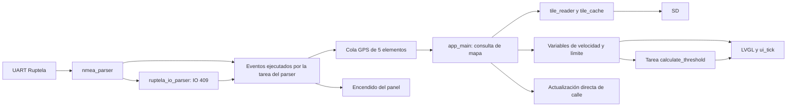

# Estado actual y revisión del firmware

Revisión: 2026-09-05. Alcance: firmware de pantalla, piloto Starlink y herramientas
de mapas presentes en el árbol de trabajo. No se modificó lógica de firmware como
parte de esta documentación.

## Plataforma

El usuario identifica la placa como ESP32-S3-Touch-AMOLED-1.75. La documentación
del fabricante especifica 8 MiB PSRAM y 16 MiB flash; falta registrar variante,
revisión y recursos detectados de cada unidad. La comparación completa con fuentes
oficiales está en [hardware y memoria](hardware-y-memoria.md).

| Recurso | Configuración observada | Fuente |
| --- | --- | --- |
| MCU y CPU | ESP32-S3, 240 MHz | [sdkconfig](../sdkconfig) |
| Pantalla | 466 × 466 QSPI; driver local SH8601, fabricante indica CO5300 | [Puerto de display](../main/waveshare_amoled_lcd_port.h); discrepancia a verificar en placa |
| Touch | Deshabilitado mediante `USE_TOUCH=0` | Mismo puerto |
| Ruptela | UART1 RX GPIO18; detección 9600/115200 baud | [Parser](../main/nmea_parser.h) y sdkconfig |
| Interfaz eléctrica | RS232 convertido a TTL de 3,3 V, según montaje documentado | [Notas Starlink](../../../starlink-backup.md) |
| SD | SDMMC de 1 bit: CLK=2, CMD=1, D0=3 | [SD manager](../components/sd_card/sd_manager.c) |
| PSRAM | Octal, 80 MHz; tamaño autodetectado; modelo anunciado con 8 MiB | sdkconfig y hardware/memoria |
| Flash | sdkconfig y particiones para 16 MB; defaults todavía indican 8 MB | [Defaults](../sdkconfig.defaults), [particiones](../partitions.csv) |
| Aplicación | Dos slots OTA de 3 MiB; sin servicio OTA integrado ni rollback habilitado | particiones, sdkconfig y código de `main/` |

La discrepancia 8/16 MB debe resolverse antes de considerar reproducible un build
desde configuración limpia. La tabla de particiones no demuestra por sí sola la
capacidad física de una placa. Tampoco reserva RAM para una función nueva.

## Qué existe y dónde

| Función | Pantalla `Firmware` | Piloto `starlink_pilot` |
| --- | --- | --- |
| NMEA y autodetección de baud | Sí | Sí, con implementación divergente |
| IO 409 / ignición | Sí; controla encendido del panel | Sí; bloqueo de envío configurable, desactivado por defecto |
| IMEI e IO 418 | No expuestos a la aplicación | Sí |
| Record binario completo para reenviar | No expuesto | Sí, con validación adicional |
| Mapas, caché PSRAM y matching | Sí | No |
| Wi-Fi STA y cliente TCP Ruptela | No integrados | Sí |
| Paquete cmd 68 / heartbeat 16 | No integrados | Sí |
| Confirmación de entrega que conserva pendientes hasta ACK | No | No; recibe/loguea respuestas |
| TLS del cliente de telemetría | No | No; usa sockets TCP |
| App, emparejamiento e instalador de mapas | No | No |

El código del piloto ya supera el estado de algunas listas de tareas en las notas
originales. Reutilizarlo exige revisar diferencias; copiar `telematics.c` completo
al HUD mantendría acoplados Wi-Fi, política de envío, colas y protocolo.

## Recorrido actual de datos en la pantalla

La velocidad se muestra después de la consulta al mapa: una lectura SD lenta
también retrasa el dato de velocidad. Los eventos de ignición se atienden en la
tarea del parser; esperar el mutex del display allí retrasa la recepción UART.

## Hallazgos a resolver

| ID | Hallazgo y efecto | Ubicación / tratamiento propuesto |
| --- | --- | --- |
| F01 | No se comprueba `gps.valid` antes de matching ni hay vencimiento al cesar GPS. El límite anterior queda indefinidamente y el inicial es 78. | [app_main](../main/offline_maps.c), [vars](../main/vars.c). Estados explícitos de validez y antigüedad. |
| F02 | En HUD se ignora `UART_DATA` y se espera newline. Ambos parsers NMEA terminan en byte cero, aunque el transporte contiene binario. | [HUD](../main/nmea_parser.c), [piloto](../../starlink_pilot/main/nmea_parser.c). El piloto ya drena UART por datos; falta resolver framing NMEA/binario compartido. |
| F03 | `set_street_name` modifica LVGL sin mutex; velocidad/límite son globals compartidos entre tareas. | [dynamic](../main/dynamic.c). Snapshot coherente consumido por la tarea UI. |
| F04 | Si falla el montaje SD, se retorna antes de iniciar GPS/ignición. El panel empieza apagado. Varias creaciones de tareas/colas no verifican errores. | [Inicio](../main/offline_maps.c). Arranque degradado y recuperación. |
| F05 | La cola GPS usa `xQueueSendFromISR` desde un callback de tarea e ignora el resultado. Acumular fixes puede aumentar el retraso. | [Handler](../main/offline_maps.c). API de tarea y mailbox de último fix para visualización. |
| F06 | Caché sin invalidación ni versión; un `fopen` fallido se memoriza como ausencia sin distinguir error de SD. | [Caché](../components/tile_reader/tile_cache.c). Errores tipados y generación de dataset. |
| F07 | Los tiles v1 no tienen firma mágica, versión ni integridad; un archivo truncado puede aportar candidatos del prefijo válido. | [Lector](../components/tile_reader/tile_reader.c). Rechazo completo de payload inválido e integridad en la [cápsula propuesta](capsula-mapas.md); no requiere migrar a v2. |
| F08 | Histéresis estática sin reset; resultado solo bool, velocidad y nombre. Nombre y límite pueden provenir de vías distintas. | Lector. Estado explícito y procedencia separada del nombre/límite. |
| F09 | El generador asigna vías a tiles por sus vértices; una arista larga puede cruzar tiles no incluidos. La salida temprana a 15 m puede omitir un candidato vecino mejor. | [Generador v1](../../../python/extract_tiles.py), lector. Casos geométricos sintéticos antes de cambiar heurísticas. |
| F10 | Parser y matcher usan float para coordenadas; convertir luego a E7 no recupera precisión. La proyección del segmento usa grados sin escalado longitudinal. | Parser/lector. Medir contra referencia; cambiar matemática separado del refactor. |
| F11 | IO 418 no tiene vencimiento en el piloto; se verifica la habilitación al principio del ciclo, antes de operaciones de red bloqueantes. | [Telemática](../../starlink_pilot/main/telematics.c). Estado fresco, cancelación y nueva comprobación antes de cada envío. |
| F12 | El piloto extrae registros de la cola y vacía ciclos sin esperar ACK. Puede descartar al llenarse y conservar registros antiguos durante períodos sin permiso. | Telemática. Política explícita de cola, ACK, antigüedad y duplicados. |
| F13 | Dos buffers DMA RGB565 de 466 × 116 píxeles consumen 216.224 bytes internos, antes de stacks y red. | Puerto LVGL. Ensayar 32/48/64 filas con medición; ahorro potencial de 152,91 KiB a 32 filas. |
| F14 | Modelo de placa documentado con CO5300, driver identificado como SH8601. No se verificó TE ni variante -G. | Verificar hardware/secuencia y posible uso compartido de GPIO18; no cambiar driver por nombre solamente. |
| F15 | Flash/defaults y versiones de UI no están plenamente alineados para regenerar desde limpio. | Defaults 8/16 MB; proyecto EEZ declara 8.3 y dependencia LVGL 8.4. Fijar perfil/exportación. |

Además: retirar ejemplos SD no usados, documentar fuentes generadas de UI,
declarar dependencias de componentes, revisar el NMEA incluido tanto explícitamente
como por glob en CMake y corregir README/configuración obsoletos. Los warnings
de punteros colgantes en EEZ requieren investigación; el build los degrada de
error a warning, lo que no demuestra que sean inocuos.

Se localizó la fuente editable de UI:
[speed_monitor.eez-project](../../../eez-studio/speed_monitor/speed_monitor.eez-project).
Debe quedar vinculada a la salida generada y a la versión de EEZ usada.

## Evidencia disponible

Evidencia de pruebas registrada en la revisión inicial de esta conversación:

- Build del HUD con ESP-IDF 5.4.4: correcto; binario `0x19c5c0` bytes, 46% libre
  en el slot de 3 MiB. Hubo warnings de configuración obsoleta, EEZ y entorno GDB.
- Cuatro casos del parser IO del HUD: correctos con ASan/UBSan.
- Suite Python `python/tests`: 205 casos correctos; cubre herramientas/formato,
  no el comportamiento completo del matcher C del HUD.
- Ocho casos de IO y cuatro de protocolo del piloto: correctos con ASan/UBSan,
  compilados en un directorio temporal durante la documentación.

Las [notas de laboratorio](../../../starlink-backup.md) reportan ACK 100/116 en un
replay a flespi del 2026-09-02. No se repitió esa conexión ni se envió telemetría
real durante esta revisión. No se ensayó la Waveshare con UI + mapas + Wi-Fi
simultáneos, ni cortes de energía durante actualizaciones.

En la ampliación del blueprint se analizó el `.map` existente con `esp_idf_size`:
imagen sin padding 1.688.886 bytes y rodata 1.040.068 bytes. No es una medición de
heap libre en ejecución; interpretación y presupuesto en
[hardware y memoria](hardware-y-memoria.md). No se recompiló ni flasheó para esa
ampliación documental.
