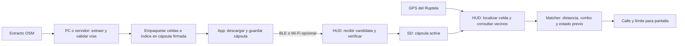

# Qué se procesa: del mapa OSM a la consulta del display

Investigación: 2026-09-05. Se revisaron el generador v1, el lector/caché del HUD
y todos los archivos de `python/tiles` disponibles localmente. La cápsula y su
transferencia BLE siguen siendo propuestas; no se ejecutó una prueba de radio.

## Qué significa tile en este proyecto

Es una celda de una grilla geográfica de 0,003° por lado, aproximadamente
330 × 275 metros a la latitud de Buenos Aires. Contiene registros binarios de
vías: secuencia de coordenadas, límite numérico y nombre UTF-8. Son datos para
calcular sobre qué calle circula el vehículo, no imágenes de un mapa.

El [generador actual](../../../python/extract_tiles.py) lee un `.osm.pbf` con
pyosmium, toma vías con etiqueta `highway`, obtiene coordenadas de sus nodos,
interpreta `maxspeed` y guarda el nombre. En el binario v1:

| Campo | Tamaño |
| --- | --- |
| Cantidad de registros del tile | 4 bytes |
| Cantidad de puntos de una vía | 2 bytes por registro |
| Puntos: latitud/longitud como enteros × 10⁷ | 8 bytes por punto |
| Límite de velocidad | 2 bytes por registro |
| Longitud del nombre | 2 bytes por registro |
| Nombre UTF-8 | Longitud variable |

Tamaño del tile: `4 + suma(6 + 8 × puntos + bytes_del_nombre)`.
El ejemplo local `tile_-34587_-58446.bin` tiene 22 registros y 1.150 bytes.
Incluye «Doctor Emilio Ravignani», dos puntos y límite 40: ese registro ocupa
45 bytes. Estos valores describen el dataset, no validan el límite real de la vía.

El generador copia la vía completa en cada celda que contiene alguno de sus
vértices. Por eso hay geometría repetida y no se trata de recortes exactos contra
el borde de cada celda. Una arista larga también puede atravesar una celda sin
vértices y quedar ausente de su índice: es una corrección de cobertura separada.
El valor 0 significa límite no obtenido por este parser; no es un límite válido
de cero km/h. El binario no conserva todas las reglas condicionales de OSM.

## Qué hace cada parte

**PC o servidor de publicación:** ejecuta el procesamiento geográfico pesado,
genera el dataset, lo verifica y publica la edición firmada. Primero puede
empaquetar la salida existente. Es posible evolucionar el generador para escribir
al contenedor sin producir archivos intermedios, pero no es requisito inicial.
No se ejecuta este procesamiento por cada cliente ni durante cada consulta GPS.

**Teléfono:** consulta compatibilidad, descarga el paquete listo y transmite
bytes con reanudación. No necesita interpretar OSM, recalcular calles ni generar
tiles. Conserva el archivo hasta que el equipo confirma la versión activa.

**HUD durante instalación:** recibe bloques, escribe una candidata, comprueba
integridad/autenticidad/estructura y activa según mantenimiento. No convierte
OSM ni descomprime miles de archivos. El parser valida los payloads antes de READY.

**HUD durante uso:** a partir del GPS calcula la celda y consulta los candidatos
del mapa local. El lector actual revisa la celda principal y puede buscar hasta
ocho vecinas, con poda por distancia y salida temprana. Puntúa geometría con
distancia, rumbo y continuidad previa; la caché evita repetir lecturas de SD.
La cápsula sustituye búsqueda por ruta por búsqueda en índice y lectura de rango;
preserva los bytes que consume el parser. El teléfono puede estar ausente.

## Tres unidades diferentes

| Unidad | Para qué sirve | Ejemplo |
| --- | --- | --- |
| Celda o tile | Encontrar vías cercanas al GPS | Un conjunto de calles alrededor del vehículo |
| Cápsula | Distribuir, verificar y activar una edición completa | Una cobertura elegida por el cliente |
| Bloque de transferencia | Llevar bytes por BLE/Wi-Fi con memoria acotada | Un rango de la cápsula, fragmentado según el enlace |

Un tile puede cruzar varios bloques de transferencia. Un bloque puede contener
datos de varios tiles. El teléfono no necesita conocer esa relación: envía rangos
de un archivo. BLE tampoco obliga a cambiar el formato geográfico.

Agrupar tiles con un índice es una técnica existente. Como referencia, PMTiles
almacena datos por tiles en un archivo y permite leer solo rangos relevantes.
Su direccionamiento Z/X/Y difiere de la grilla actual; no se propone adoptarlo
directamente ni convertir el matcher a un mapa visual. Fuente:
[conceptos de PMTiles](https://docs.protomaps.com/pmtiles/).

## Medición de la copia local

La medición corresponde únicamente a `python/tiles`, no a toda Argentina ni a
una cobertura comercial cuya completitud se haya verificado.

| Métrica | Resultado |
| --- | --- |
| Archivos v1 | 1.961 |
| Suma de tamaños lógicos | 3.028.397 bytes, aproximadamente 3,03 MB decimales |
| Tile mínimo / mediana / percentil 95 / máximo | 42 / 1.150 / 4.026 / 14.817 bytes |
| Registros almacenados / puntos | 44.005 / 290.548, incluyendo repeticiones entre tiles |
| Registros con límite 0 / sin nombre | 21.906 / 18.477, incluyendo repeticiones |
| Errores en lectura estructural de esta copia | 0 |

Se recorrieron todos los binarios verificando conteos, al menos dos puntos por
registro, límites de lectura, UTF-8 y fin exacto del archivo. Esa lectura no valida
la exactitud geográfica, la procedencia, los límites viales ni el firmware en placa.
Los tamaños son bytes lógicos; no se midió ocupación física por clusters FAT.

Identidad del inventario medido: SHA-256
`4d836e1973f9062cde146144f58811380ebe477f2757e04e430ee5c64ce21f80`.
Se calculó sobre líneas UTF-8 ordenadas por ruta relativa con la forma
`ruta<TAB>tamaño_decimal<TAB>sha256_del_archivo<LF>`.

Con las entradas propuestas de 56 bytes, el índice plano sumaría 109.816 bytes.
Payloads + esas entradas darían 3.138.213 bytes, antes de cabecera, manifiesto,
directorios, autenticación de páginas y padding. **No es todavía el tamaño de una
cápsula construida**, ni empaquetar equivale a comprimir.

A un caudal útil hipotético de 30 kB/s, esos 3,14 MB tomarían aproximadamente
1 min 45 s de envío, más metadatos, validación y activación. Esto sirve para
dimensionar la prueba BLE; no es una medición de transferencia. Medir una región
completa antes de extrapolar desde esta copia pequeña.

## Consecuencia para el diseño

Conservar la celda como unidad de búsqueda permite reutilizar el matcher y
eliminar archivos por tile en el equipo. Para esta copia local tiene sentido
ensayar primero una cápsula completa por BLE, sin hacer depender el ensayo de
compresión, parches diferenciales ni v2/zonas.

Si otras coberturas resultan grandes, medir por separado selección de cobertura,
compresión y envío de cambios. Son optimizaciones pendientes; cualquier envío de
cambios tendría que reconstruir una candidata verificable sin tocar la activa.
La [cápsula](capsula-mapas.md) y el [transporte desde la app](actualizacion-mapas.md)
mantienen sus contratos aunque esa investigación se descarte.
